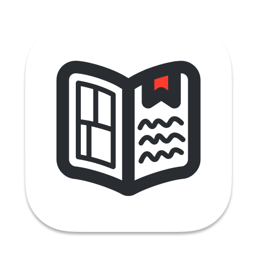

<!-- Improved compatibility of back to top link: See: https://github.com/othneildrew/Best-README-Template/pull/73 -->

<!--
*** Thanks for checking out the Best-README-Template. If you have a suggestion
*** that would make this better, please fork the repo and create a pull request
*** or simply open an issue with the tag "enhancement".
*** Don't forget to give the project a star!
*** Thanks again! Now go create something AMAZING! :D
-->

<!-- PROJECT SHIELDS -->
<!--
*** I'm using markdown "reference style" links for readability.
*** Reference links are enclosed in brackets [ ] instead of parentheses ( ).
*** See the bottom of this document for the declaration of the reference variables
*** for contributors-url, forks-url, etc. This is an optional, concise syntax you may use.
*** https://www.markdownguide.org/basic-syntax/#reference-style-links
-->
[![Contributors][contributors-shield]][contributors-url]
[![Forks][forks-shield]][forks-url]
[![Stargazers][stars-shield]][stars-url]
[![Issues][issues-shield]][issues-url]
[![GPLv3 License][license-shield]][license-url]

<!-- PROJECT LOGO -->
 

  

<h3 align="center">Novee</h3>

  

    Novee is an application written in Swift that lets you watch anime, read manga or read novels. You will be able to keep track of the series you watch through a list, as well as being able to download them for watching offline.
     
    <a href="https://discord.gg/3BdpsdPN7r"><strong>Join the discord »</strong></a>
     
     
    <a href="https://github.com/ZhichGaming/Novee">View Demo</a>
    ·
    <a href="https://github.com/ZhichGaming/Novee/issues">Report Bug</a>
    ·
    <a href="https://github.com/ZhichGaming/Novee/issues">Request Feature</a>
  

<!-- TABLE OF CONTENTS -->

  
Table of Contents

  <ol>
    <li>
      <a href="#about-the-project">About The Project</a>
    </li>
    <li>
      <a href="#getting-started">Getting Started</a>
      <ul>
        <li><a href="#prerequisites">Prerequisites</a></li>
        <li><a href="#installation">Installation</a></li>
      </ul>
    </li>
    <li><a href="#contributing">Contributing</a></li>
    <li><a href="#license">License</a></li>
    <li><a href="#contact">Contact</a></li>
    <li><a href="#acknowledgments">Acknowledgments</a></li>
  </ol>

<!-- ABOUT THE PROJECT -->
## About The Project

[![Novee Screen Shot][product-screenshot]](https://github.com/ZhichGaming/Novee/edit/master/README.md)

Novee is an application made in Swift that lets you read manga, watch anime, read novels and keep track of them. This is my first big project and is still in development, any contribution is appreciated!

(<a href="#readme-top">back to top</a>)

<!-- GETTING STARTED -->
## Getting Started

To get a local copy up and running follow these simple steps.

### Prerequisites

* Install Xcode from the Mac App Store.
* Install Git from homebrew using the command `brew install git` or https://git-scm.com/downloads if you prefer.

### Installation

1. Clone the project using the command `git clone https://github.com/ZhichGaming/Novee.git`. Alternatively, you can use Xcode to clone by clicking Source Control > Clone on the menu bar.
2. Open the project through Xcode by clicking File > Open on the menu bar. Navigate to the folder you cloned the project and click open.
3. Get a codesigning profile if you haven't already by pressing `Xcode` in the menu bar and then clicking `Settings`. Press the `Accounts` tab and click the `+` button at the bottom left. Select `Apple ID`. 
4. Click the topmost element in the project navigator. In the tab that opens, click the `Signing & Capabilities` tab and enable `Automatically manage signing`. Then select your signing profile you just created. 

(<a href="#readme-top">back to top</a>)

<!-- CONTRIBUTING -->
## Contributing

Contributions are what make the open source community such an amazing place to learn, inspire, and create. Any contributions you make are **greatly appreciated**.

If you have a suggestion that would make this better, please fork the repo and create a pull request. If you want to make big changes, please open an issue first, discussing what you want to change. You can also simply open an issue with the tag "enhancement".
Don't forget to give the project a star! Thanks again!

1. Fork the Project
2. Create your Feature Branch (`git checkout -b feature/AmazingFeature`)
3. Commit your Changes (`git commit -m 'Add some AmazingFeature'`)
4. Push to the Branch (`git push origin feature/AmazingFeature`)
5. Open a Pull Request

(<a href="#readme-top">back to top</a>)

<!-- LICENSE -->
## License

Distributed under the GNU General Public License v3.0 (GPLv3). See `LICENSE` for more information.

(<a href="#readme-top">back to top</a>)

<!-- CONTACT -->
## Contact

Twitter: [@ZhichGaming](https://twitter.com/@ZhichGaming)
Email: nick.zhicheng@gmail.com

Project Link: [https://github.com/ZhichGaming/Novee](https://github.com/ZhichGaming/Novee)

(<a href="#readme-top">back to top</a>)

<!-- ACKNOWLEDGMENTS -->
## Acknowledgments

* [SwiftSoup](https://github.com/scinfu/SwiftSoup)
* [CachedAsyncImage](https://github.com/lorenzofiamingo/swiftui-cached-async-image)
* [SystemNotification](https://github.com/danielsaidi/SystemNotification)

* [Book in app icon](https://www.svgrepo.com/svg/496863/book-saved)

(<a href="#readme-top">back to top</a>)

<!-- MARKDOWN LINKS & IMAGES -->
<!-- https://www.markdownguide.org/basic-syntax/#reference-style-links -->
[contributors-shield]: https://img.shields.io/github/contributors/ZhichGaming/Novee.svg?style=for-the-badge
[contributors-url]: https://github.com/ZhichGaming/Novee/graphs/contributors
[forks-shield]: https://img.shields.io/github/forks/ZhichGaming/Novee.svg?style=for-the-badge
[forks-url]: https://github.com/ZhichGaming/Novee/network/members
[stars-shield]: https://img.shields.io/github/stars/ZhichGaming/Novee.svg?style=for-the-badge
[stars-url]: https://github.com/ZhichGaming/Novee/stargazers
[issues-shield]: https://img.shields.io/github/issues/ZhichGaming/Novee.svg?style=for-the-badge
[issues-url]: https://github.com/ZhichGaming/Novee/issues
[license-shield]: https://img.shields.io/github/license/ZhichGaming/Novee.svg?style=for-the-badge
[license-url]: https://github.com/ZhichGaming/Novee/blob/master/LICENSE
[linkedin-shield]: https://img.shields.io/badge/-LinkedIn-black.svg?style=for-the-badge&logo=linkedin&colorB=555
[product-screenshot]: images/anime-menu.png
